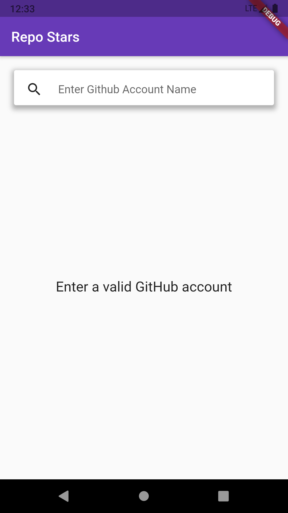
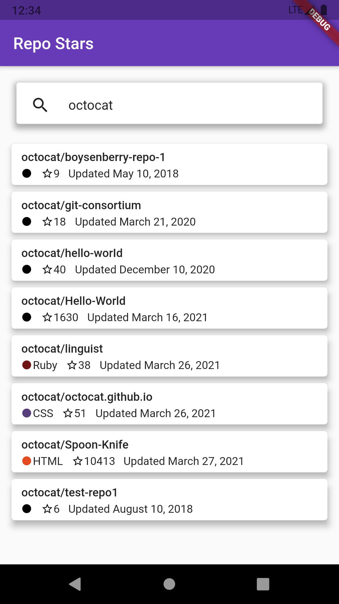
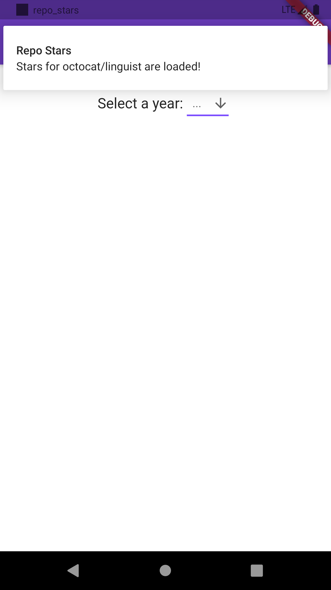
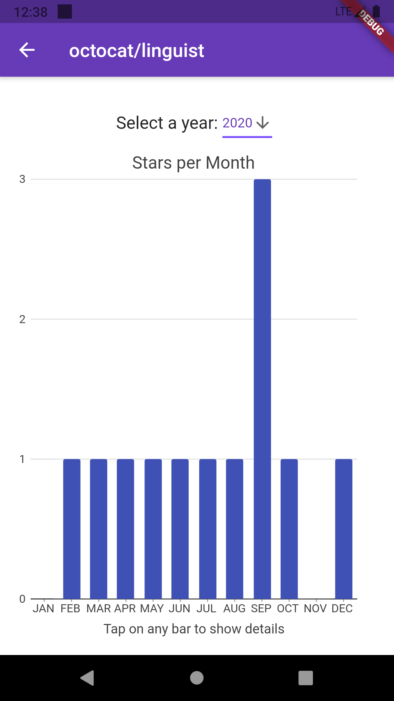
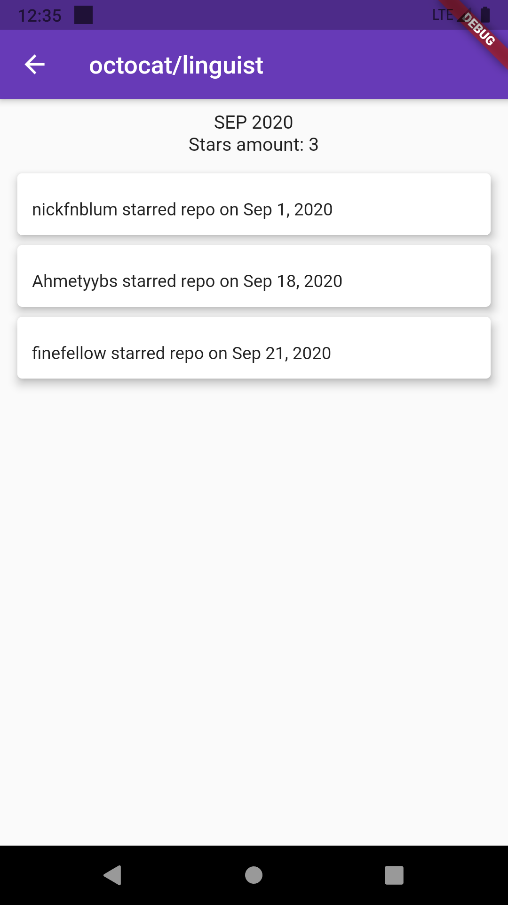

# Repo Stars

Check the stars of a repo. Cool graph included.

## Enter Github Account Name

## Select a Repo

Repositories are saved in local database.

## Select a Year

Stars are loading in background. Notification is sent when loading is finished. Stars are saved in local database.
Stars are shown per month, per selected year.

## Select a Month 

Tap a month to see stargazers.

## Stargazers List

### If internet connection is absent, already saved repos and stars are loaded from local databases.

